# ComfyUI ALICE Lab Audio Tools

<table>
  <thead><tr><th><a href="README.md">English</a></th><th>日本語</th></tr></thead>
</table>

ComfyUI ALICE Lab Audio Toolsは、メディア範囲の選択、音声の編集・比較、波形・スペクトログラムの可視化、動画音声の置換を行うComfyUIカスタムノード集です。

> **状態:** アルファ版です。ノードのインターフェースとUI動作は今後変更される場合があります。

<p align="center">
  <a href="docs/images/workflow-overview.png">
    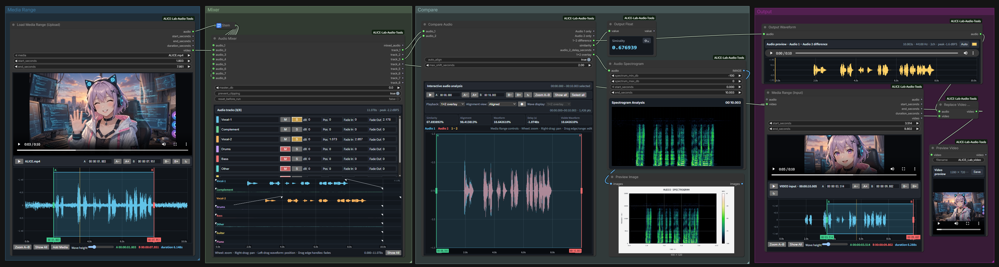
  </a>
</p>

<p align="center"><sub>ALICE Lab Audio Toolsのワークフロー例。画像をクリックすると拡大表示します。</sub></p>

## 機能

| カテゴリ | ノード | 用途 |
| --- | --- | --- |
| Media | `Load Media Range (Upload)` | ローカルメディアをアップロードし、波形を見ながらA-B範囲を選んで`AUDIO`と`VIDEO`を出力します。 |
| Media | `Load Media Range (Path)` | 絶対パスのメディアを開き、A-B範囲を選んで`AUDIO`と`VIDEO`を出力します。 |
| Media | `Media Range (Input)` | 上流の`AUDIO`または`VIDEO`をプレビューし、選択範囲を下流へ渡します。 |
| Audio | `Audio Mixer` | 最大8トラック。クリップ長の変更、クリップ単位でのコピー、ペースト、切り取り、削除、複製（トラック間にも対応）。波形表示を使って配置・ミックスします。 |
| Audio | `Compare Audio` | 2つの音声を自動整列し、差分、類似度、遅延を出力します。 |
| Audio | `Audio Spectrogram` | dBFSスペクトログラムを表示し、`IMAGE`として出力します。 |
| Audio | `Audio to Irodori Ref Config` | `AUDIO`をcomfy-Irodori-TTSの参照音声用`IRODORI_REF_CONFIG`へ変換します。 |
| Audio | `Output Waveform` | `AUDIO`を再生し、波形と基本情報を確認します。 |
| Utils | `Output Float` | 接続した`FLOAT`を指定精度で表示してそのまま渡します。 |
| Video | `Replace Video Audio` | 動画映像を保ったまま音声を置換します。 |
| Video | `Preview Video` | `VIDEO`をノード内で再生・ダウンロードします。 |
| Video | `Video First / Last Frame` | `VIDEO`の最初と最後のフレームを`IMAGE`として出力します。 |

ノードはAdd Nodeメニューの次のカテゴリに表示されます。

```text
ALICE_Lab
├── Audio
├── Media
├── Video
└── Utils
```

## 動作要件

- 現行の`AUDIO`型と`comfy_api.latest`動画APIを持つComfyUI
- 通常はComfyUIに含まれるPyTorch
- ComfyUIプロセスから実行できる`ffmpeg`と`ffprobe`
- ComfyUIフロントエンドをサポートするモダンブラウザ

`ffmpeg`と`ffprobe`はプロセスの`PATH`から検索します。macOSではGUI起動時にPATHが引き継がれない場合があるため、`/opt/homebrew/bin`と`/usr/local/bin`も確認します。

モデル、推論エンジン、CUDAランタイム、FFmpegバイナリ、メディアサンプル、デスクトップアプリは同梱しません。

## インストール

1. このリポジトリを`ComfyUI/custom_nodes`直下へcloneまたは展開します。
2. リポジトリ直下の`__init__.py`を保持し、さらに入れ子のパッケージ階層を作らないでください。
3. ComfyUIを起動するプロセスから`ffmpeg`と`ffprobe`が見えることを確認します。
4. ComfyUIを再起動します。
5. Add Nodeメニューに`ALICE_Lab`カテゴリが表示されることを確認します。

```text
ComfyUI/
└── custom_nodes/
    └── ComfyUI-ALICE-Lab-Audio-Tools/
        ├── __init__.py
        ├── src/
        │   ├── nodes.py
        │   ├── audio_compare.py
        │   └── audio_spectrogram.py
        └── web/
```

ComfyUIが提供するライブラリ以外の追加pip依存はありません。FFmpegはシステム側の依存です。

## クイックスタート

サンプルワークフローのJSONファイルは[`docs/examples/`](docs/examples/)にあります。

### 動画の一部を選択して処理する

```text
Load Media Range
  ├── audio ──> 音声処理またはAudio Mixer ──> Replace Video Audio.audio
  └── video ─────────────────────────────────> Replace Video Audio.video

Replace Video Audio.video ──> Preview Video
```

<p align="center">
  <a href="docs/images/select_and_process_part_of_video.png">
    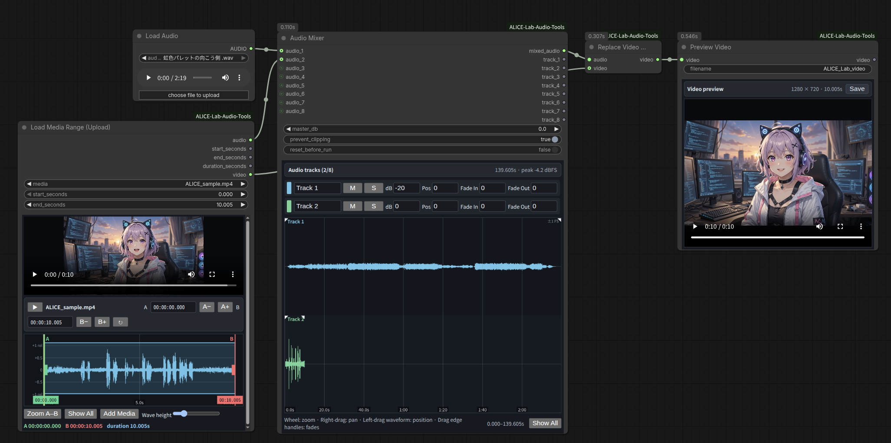
  </a>
</p>

### 2つの音声を比較する

```text
audio result 1 ──> Compare Audio.audio_1
audio result 2 ──> Compare Audio.audio_2

Compare Audio.similarity              ──> Output Float
Compare Audio.audio_2_delay_seconds   ──> Output Float
Compare Audio.1−2 difference          ──> Output Waveform
```

<p align="center">
  <a href="docs/images/compare_two_audio _results.png">
    
  </a>
</p>

### スペクトログラム画像を作成する

```text
AUDIO ──> Audio Spectrogram ──> IMAGE
```

<p align="center">
  <a href="docs/images/create_spectrogram _mage.png">
    
  </a>
</p>

### 選択範囲をIrodori-TTSの参照音声にする

```text
Media Range (Input).audio
  ──> Audio to Irodori Ref Config.audio
  ──> IrodoriTTS Sampler.ref_config
```

受け側のSamplerには[comfy-Irodori-TTS](https://github.com/jupo-ai/comfy-Irodori-TTS)が必要です。未インストールでもALICE Lab Audio Tools自体の読み込みには影響しません。

## ノードリファレンス

### Load Media Range (Upload)

ローカルメディアをアップロードし、波形でA-B範囲を選択して`AUDIO`と`VIDEO`を出力します。ComfyUI標準のアップロード上限では100 MB以下です。アップロード済みファイルは`ComfyUI/input`に保存されます。

<p align="center"><a href="docs/images/load-media-range-upload.png">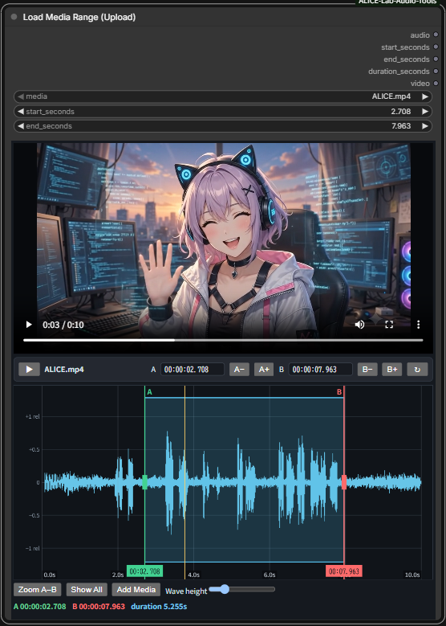</a></p>

入力は`media`、`start_seconds`、`end_seconds`です。出力は選択済み44.1 kHzステレオ`audio`、実際の開始・終了・長さ、および動画を含む素材では`video`です。上限を超える場合やコピーを避ける場合はPath版を使用してください。

### Load Media Range (Path) / Media Range (Input)

Path版は絶対パスの対応ファイルをコピーせずに開きます。信頼できるComfyUIサーバーだけで使い、信頼できない利用者に無制限のサーバー側パスを公開しないでください。Input版は上流の`AUDIO`または`VIDEO`を1つだけ受け、音声入力のサンプルレート・チャンネルを保持します。初期値`end_seconds = 0`は入力全体を選択します。

### Audio to Irodori Ref Config

ComfyUI標準`AUDIO`と、IrodoriTTS Reference Audioと同じ`normalize_ref_audio`、`max_ref_seconds`を受けます。出力`IRODORI_REF_CONFIG`はIrodoriTTS Samplerへ直接接続できます。

<p align="center"><a href="docs/images/rodori_ref_config.png">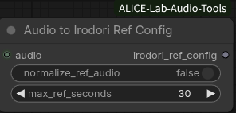</a></p>

先頭の音声バッチをmono化し、元のサンプルレートを保ったPCM16 WAVとして`ComfyUI/temp/alice_lab_audio_tools/irodori_ref/`へ保存します。ファイル名は音声内容のハッシュなので、同じ音声の再実行では同じファイルを再利用します。現在は comfy-Irodori-TTS の IrodoriTTS Sampler で利用できます。

### Audio Mixer

最大8個の入力を共有タイムラインでミックスします。トラック名・色、クリップ単位のゲイン・位置・フェード、ミュート、ソロ、マスターゲイン、クリッピング保護を設定できます。`mixed_audio`と処理済みの`track_1`から`track_8`を出力します。

<p align="center"><a href="docs/images/audio-mixer.png">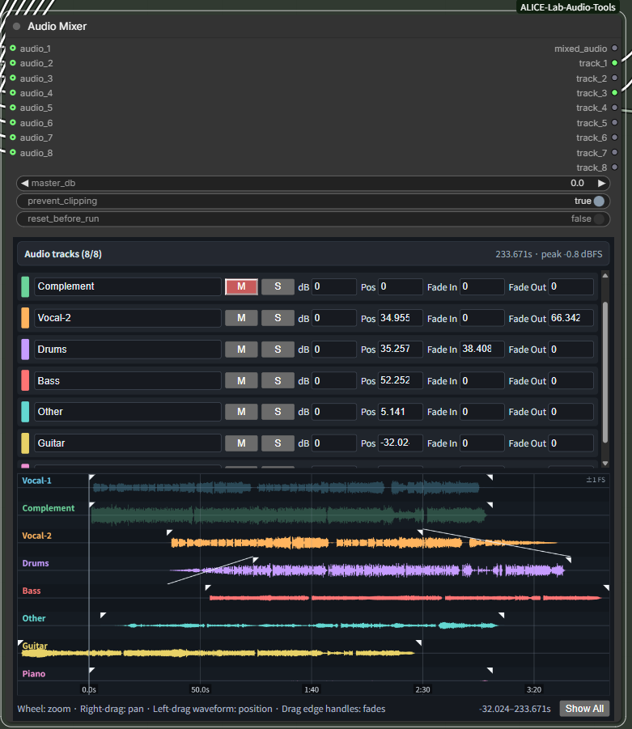</a></p>

クリップをクリックして選択し、ドラッグでタイムライン位置を変更します。左右端をドラッグして短縮・延長でき、短縮した部分は再び伸ばして復元できます。元音声より長くした部分には無音が追加され、波形表示とミックス出力にも編集後のクリップ長が反映されます。上端のハンドルでリニアフェードを変更し、`dB`、`Pos`、`Fade In`、`Fade Out`のラベルをダブルクリックすると、その値を0へ戻せます。

クリップを右クリックすると`Copy`、`Cut`、`Duplicate`、`Delete`を実行できます。CopyまたはCut後、同じトラックまたは別トラックの貼り付けたい時刻を右クリックして`Paste`を選びます。Duplicateは元クリップの直後へ新しい編集可能なクリップを配置します。

`reset_before_run`を有効にすると、クリップ編集とCopy/Pasteしたクリップを消去し、ゲイン・位置・フェードをリセットします。

### Compare Audio

2つの波形を比較し、自動整列、整列済み音声、差分、オーバーレイ、類似度、遅延を出力します。類似度は音声信号の比較値であり、音声認識・話者同定・知覚品質評価・同一録音の証明ではありません。

<p align="center"><a href="docs/images/compare-audio.png">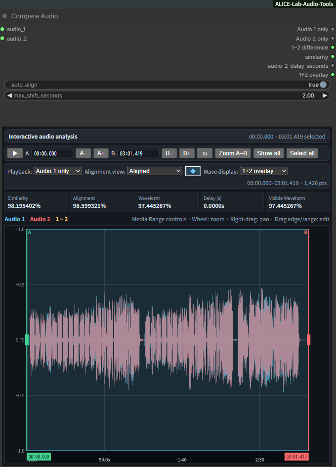</a></p>

### Audio Spectrogram / Output Waveform / Output Float

Audio SpectrogramはdBFSスペクトログラムを`IMAGE`として出力します。Output Waveformは再生、波形、長さ、サンプルレート、チャンネル数、ピークdBFSを表示します。Output Floatは`FLOAT`を0〜12桁で表示し、値をそのまま渡します。

<p align="center"><a href="docs/images/audio-spectrogram.png">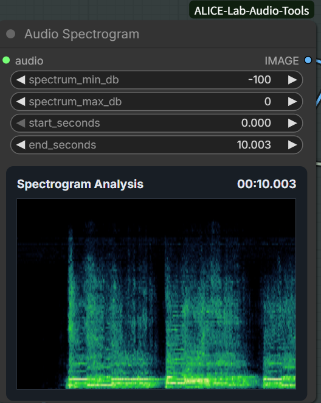</a></p>
<p align="center"><a href="docs/images/output-waveform.png">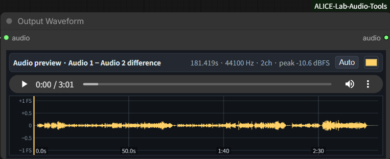</a></p>
<p align="center"><a href="docs/images/output-float.png">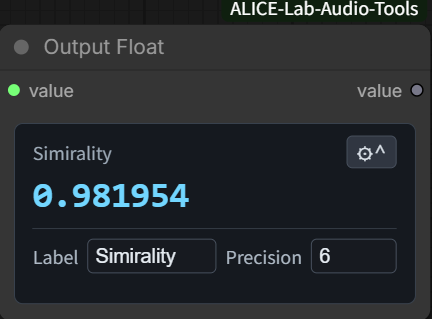</a></p>

### Replace Video Audio / Preview Video

Replace Video Audioは動画映像を保持して接続済み音声へ置き換えます。音声はAAC 192 kbpsでエンコードし、短い音声は無音で補完、長い音声は動画尺に合わせて切り詰めます。Preview Videoは接続した`VIDEO`を再生・ダウンロードし、任意のサーバー側出力先へ直接書き込みません。

<p align="center">
  <a href="docs/images/replace_video_audio.png">
    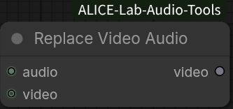
  </a>
</p>

<p align="center"><a href="docs/images/preview-video.png">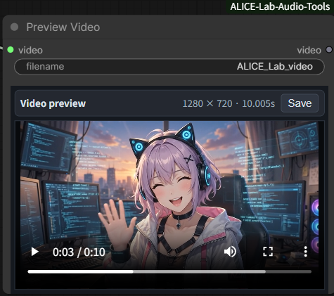</a></p>

### Video First / Last Frame

`VIDEO`の最初と最後のフレームをComfyUIの`IMAGE`として出力します。Media Rangeで切り出した動画区間の開始画像・終了画像取得にも利用できます。

## 対応メディア拡張子

```text
aac  aiff  avi  flac  m2ts  m4a  m4v  mkv  mov
mp3  mp4   mpg  mpeg  ogg   opus ts   wav  webm  wma
```

拡張子が対応していても、インストール済みFFmpegがそのコーデックをデコードできる必要があります。

## プラットフォーム別注意点とトラブルシューティング

- **Windows:** `ffmpeg.exe`と`ffprobe.exe`をComfyUIプロセスから見えるようにし、ドライブ文字、長いパス、非ASCIIファイル名を確認してください。
- **macOS:** HomebrewのFFmpeg/ffprobeを利用できます。GUI起動時のPATHを確認してください。
- **Ubuntu / Linux:** 信頼できるソースからFFmpegを導入し、ComfyUIの起動環境で両コマンドを利用可能にしてください。
- **ノードが表示されない:** リポジトリ直下の`__init__.py`、ComfyUI端末のimportエラー、`comfy_api.latest`と動画APIを確認して再起動してください。
- **UI幅・拡大率がおかしい:** ComfyUI更新後はブラウザをハードリロードしてください。Windows/Linuxでは`Ctrl+Shift+R`です。
- **比較データの有効期限切れ:** メモリ使用量を制限するためセッションは有限です。Compare Audioを再実行してください。

## 既知の制限

- メディア対応は拡張子とインストール済みFFmpegコーデックに依存します。
- ファイルベースのMedia Range出力は常に44.1 kHzステレオです。Media Range (Input)の直接`AUDIO`入力は元形式を保持します。
- Audio to Irodori Ref Configは先頭の音声バッチを使用し、その全チャンネルを平均してmono化します。
- Compare Audioは最初の音声バッチと最大2チャンネルのみを使用します。
- 自動位置合わせには振幅エンベロープの相関を使用します。そのため、無音、関連性のない音源、繰り返しの多い音声、または検索範囲を超える遅延では、意図しないオフセットが選択される場合があります。
- Audio Mixerの入力は最大8つです。
- Replace Video Audioの出力形式はMP4です。ストリームコピーからのフォールバックが必要な場合に限り、`libx264`が必要です。
- Preview Videoはブラウザで確認するための一時ファイルをダウンロードします。サーバー側へ保存するノードではありません。

## 免責事項

本プロジェクトは現状のまま提供され、明示または黙示を問わず、いかなる保証もありません。

本ソフトウェアの使用は、利用者自身の責任で行ってください。作者およびコントリビューターは、本ソフトウェアの使用によって生じたデータの損失、損害、法的問題、その他の結果について責任を負いません。

本ソフトウェアで処理する音声、動画、その他のメディアについて、適用される法律、ライセンス、著作権、および利用規約を遵守する責任は利用者にあります。

## ライセンス

本プロジェクトはApache License 2.0のもとで提供されています。
ライセンス条項の全文は[LICENSE](LICENSE)を、著作権および帰属表示については[NOTICE](NOTICE)をご覧ください。

## 作者

ALICE Lab

## 記事とワークフロー

ALICE Lab Audio Toolsの開発記録、実験、使用例、実践的なワークフローをnoteで公開しています。

[noteのALICE Lab Audio Tools開発記録](https://note.com/mydearnana/m/m84330804a3d4)

## サポート

これらのツールが役に立ち、今後の開発、テスト、メンテナンスを支援したいと思っていただけましたら、こちらからALICE Labをサポートできます。

[Buy Me a Coffee](https://buymeacoffee.com/alicelabdev)
